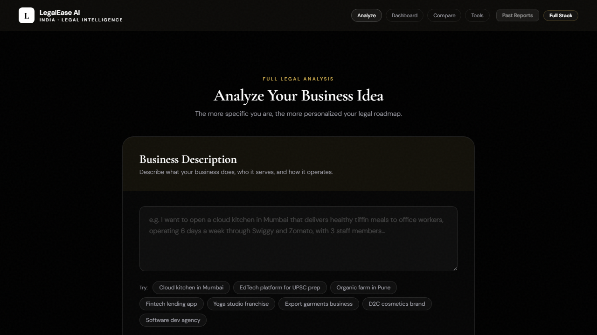

# LegalEase AI

INDIA · LEGAL INTELLIGENCE

<strong>Start Smart.</strong> <em>Stay Legal.</em>

<em>AI-powered legal intelligence for India — from business idea to a compliance roadmap: licenses, risks, penalties, action plan, and founder-ready PDFs. Built to feel fast, clear, and calm.</em>

React · Vite · FastAPI · Python Rule Engine · Gemini AI · ReportLab PDF · SQLite

---

## Contents

1. [Experience](#experience)
2. [Overview](#overview)
3. [Who it’s for](#who-its-for)
4. [At a glance](#at-a-glance)
5. [Inside the product](#inside-the-product)
6. [Screenshots](#screenshots)
7. [Technology](#technology)
8. [Disclaimer](#disclaimer)

---

## Experience

**[Open LegalEase — India](https://legal-ease-founders.vercel.app/)**

The live app runs on Vercel: analyze a business, read the legal dashboard, use the workspace and document vault, and export PDF or Excel — nothing to install.

`https://legal-ease-founders.vercel.app/`

---

## Overview

LegalEase is the same **editorial, founder-first** experience as the site: a dark, focused workspace where you describe what you’re building, then see **feasibility**, **risk**, **complexity**, and **licenses** framed the way the product presents them — structured, legible, and built for decisions.

It is **guidance**, not a law firm. It helps you see **what may matter**, **where to look**, and **what to do next**, with **past reports**, **comparison**, and **exports** when you need to share or file things away.

---

## Who it’s for

| Who | Why LegalEase |
|:----|:--------------|
| **Founders & small teams** | A first, serious map of India compliance before legal spend scales |
| **Operators** | One place for history, comparison, and execution |
| **Builders who live in details** | Vault notes, checklists, and downloads beside the in-app flow |

---

## At a glance

| Area | What you get |
|:-----|:-------------|
| **Analyze** | Idea → structured compliance-style report |
| **Dashboard** | Feasibility, risk, complexity, licenses — readable at a glance |
| **Vault** | Uploads, documents, verification notes |
| **Workspace** | Tasks, steps, comparisons, follow-through |
| **Exports** | **PDF** and **premium Excel** |

---

## Inside the product

ANALYSIS & DASHBOARD

- Describe the business; get a **structured report** aligned with India-facing logic  
- **Legal dashboard**: feasibility, risk, complexity, **licenses** in one view  
- **Hub** layout that matches how the app orients you on a case  

REPORTS & HISTORY

- **Risks**, **licenses**, **costs**, and **recommended actions** in one narrative  
- **Past reports** and **side-by-side comparison**  
- **Compliance timeline** and **apply assistant** for sequencing and next steps  

DOCUMENT VAULT

- **Uploads** and **verification** with **custom notes** so context stays attached  

WORKSPACE

- **Tasks**, **action steps**, and **comparisons** across reports or setups  

EXPORTS

- **PDF** for sharing and archives  
- **Premium Excel** for review, filters, and offline work  

---

## Screenshots

ANALYZE

  

REPORT DASHBOARD

  

---

## Technology

**Frontend:** React and Vite, **DM Sans** and **Cormorant Garamond** typography — the same calm, editorial pairing as the interface. **Backend:** FastAPI and Python, **SQLite** for data. **AI** enriches reports and supports document workflows; **ReportLab** and **Excel** generation match the export experience in the app.

Python Rule Engine · Gemini AI · ReportLab PDF · SQLite

---

## Disclaimer

LegalEase AI is **informational only**. It is **not** legal, tax, or compliance advice and **not** a substitute for a qualified lawyer, chartered accountant, or compliance professional. Always verify obligations against current law, regulators, and your facts.
